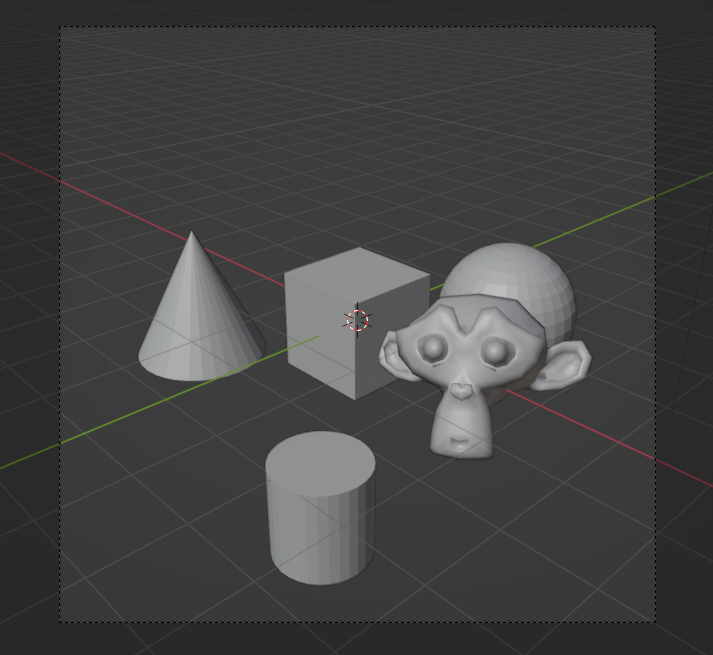
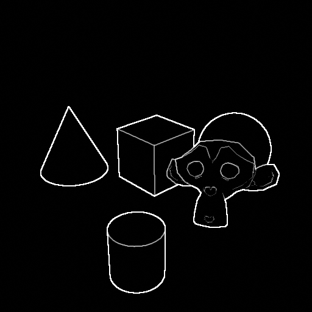
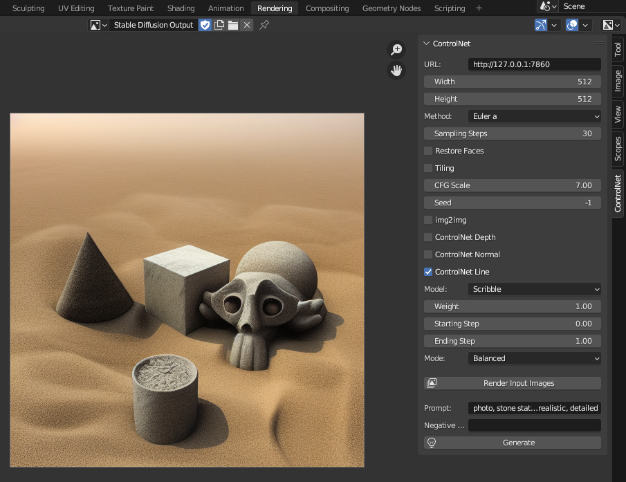

# ControlNet Render Blender Addon

A ControlNet render shortcut for blender.

## Usage

1. Follow [this guide](https://stable-diffusion-art.com/beginners-guide/) to
install [Stable Diffusion web UI](https://github.com/AUTOMATIC1111/stable-diffusion-webui)
and [sd-webui-controlnet](https://github.com/Mikubill/sd-webui-controlnet).
2. Edit `webui-user.bat`, change `set COMMANDLINE_ARGS=` to `set COMMANDLINE_ARGS=--api`.
3. Start Stable Diffusion web UI with webui-user.bat.
4. In blender, switch to the Rendering workspace, press N, click the ControlNet tab.
5. Check each ControlNet option you want, save the file, click "Render Input Images".
6. Click "Generate".